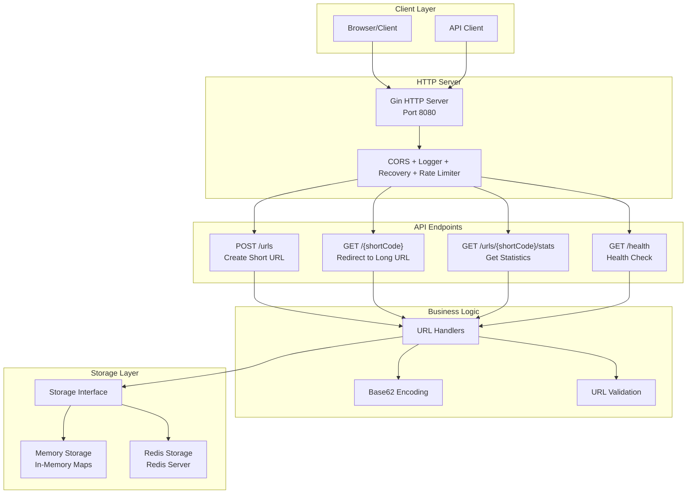

# Architecture

## Overview

The Tiny URL Service uses a clean, layered architecture with pluggable storage backends. The system handles URL shortening with Base62 encoding and supports both in-memory and Redis storage.

## Architecture Diagram

## Core Components

### HTTP Layer
- **Gin Framework**: Fast HTTP server with middleware support
- **Middleware**: CORS, logging, recovery, and rate limiting (20 req/min per IP)
- **REST API**: Four endpoints for URL operations

### Business Logic
- **URL Handlers**: Process requests and coordinate operations
- **Base62 Encoding**: Convert numeric IDs to short, URL-safe codes
- **Validation**: Ensure submitted URLs are valid HTTP/HTTPS

### Storage Interface
Abstracts storage operations with two implementations:

**Memory Storage**
- Thread-safe in-memory maps
- Atomic counter for unique IDs
- Fast but data lost on restart

**Redis Storage**
- Persistent JSON storage
- Atomic counters via Redis INCR
- Survives restarts, supports multiple instances

## Data Flow

### Creating a Short URL
1. Client POSTs JSON with long URL
2. Handler validates URL format
3. Storage generates unique ID and short code
4. Base62 encoding creates URL-safe string
5. Mapping saved to storage backend
6. Returns complete short URL

### Accessing a Short URL
1. Client GETs `/{shortCode}`
2. Handler extracts short code from path
3. Storage retrieves URL mapping
4. Returns 302 redirect to original URL

## Key Design Decisions

**Interface-Based Storage**: Easy testing and backend switching
**Base62 Encoding**: URL-safe, compact, collision-free with atomic counters
**Environment Config**: 12-factor app compliance for easy deployment
**JSON Serialization**: Human-readable for debugging

## Storage Comparison

| Feature | Memory | Redis |
|---------|--------|-------|
| **Performance** | ~13M ops/sec | ~100K ops/sec |
| **Persistence** | ❌ | ✅ |
| **Multi-Instance** | ❌ | ✅ |
| **Setup** | Zero config | Docker required |

## Testing

The system includes comprehensive testing:
- **39 total tests** with 92.4% storage coverage
- **Redis mocking** with miniredis for isolated testing
- **Rate limiter tests** with concurrent request simulation
- **Integration tests** covering all API endpoints
- **Error scenario testing** for resilience verification

The architecture is designed for simplicity and extensibility, making it easy to understand, test, and deploy. 